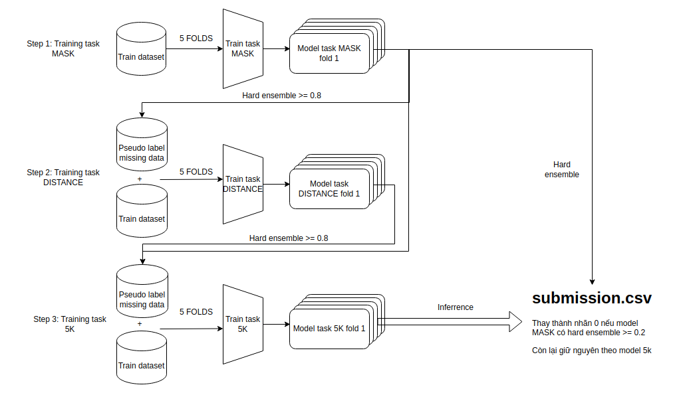

## TRAINING =======================================================

  

####Qua trinh training thuc hien theo 3 buoc: (training.sh)

Buoc 1: Training cho task MASK - support cho pseudo label

`python3 main_mask.py --dir_model_mask $DIR_MODEL_MASK --dir_train $DIR_TRAIN`

Buoc 2: Training cho task DISTANCING - support cho pseudo label

`python3 main_distancing.py --dir_model_distancing $DIR_MODEL_DISTANCING --dir_model_mask $DIR_MODEL_MASK --dir_train $DIR_TRAIN`

Buoc 3: Training cho task 5K

`python3 main_5k.py --dir_model_5k $DIR_MODEL_5K --dir_model_distancing $DIR_MODEL_DISTANCING --dir_train $DIR_TRAIN`

#### PARAMESTER:

DIR_MODEL_5K='/model/train_5k' - "Thu muc luu model task 5K"

DIR_MODEL_MASK='/model/train_mask' - "Thu muc luu model task MASK"

DIR_MODEL_DISTANCING='/model/train_distancing' - "Thu muc luu model task DISTANCING"

DIR_TRAIN='/model/train' - "Thu muc data training"

## INFER ===========================================================

`./predict.sh /model/train_5k/ /model/train_mask/ /data/ /result/submission.csv`

#### PARAMESTER:

/model/train_5k/: duong dan toi model task 5K

/model/train_mask/: duong dan toi model task MASK

/data/: duong dan toi data test

/result/submission.csv: duong dan luu file submit
