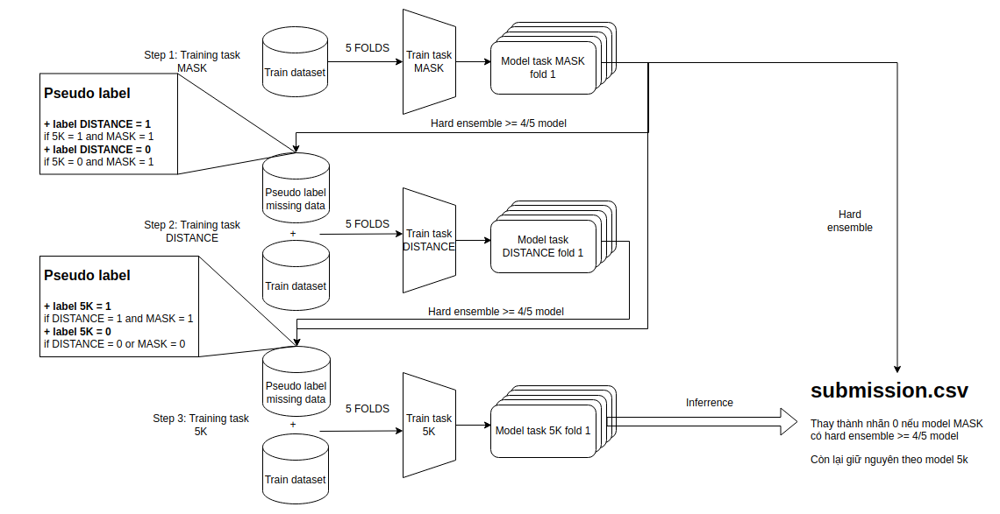

## PIPELINE =======================================================

<div align="center">
  
</div>

- Ý tưởng: Xử lý các missing label bằng phương pháp pseudo label

  + Step 1: Training với task MASK trên bộ dữ liệu train gốc

  + Step 2: Sử dụng model task MASK để tạo pseudo label cho nhãn DISTANCE, sau đó training model task DISTANCE
  
```python
  if 5K == 1 and MASK == 1:
      DISTANCE = 1
  elif 5K == 0 and MASK == 1:
      DISTANCE = 0
```
  
  + Step 3: Sử dụng mask task MASK và task DISTANCE tạo pseudo cho nhãn 5K, sau đó training model task 5K
  
```python
  if DISTANCE == 1 and MASK == 1:
      5K = 1
  elif DISTANCE == 0 or MASK == 0:
      5K = 0
```
  
### TRAINING: (training.sh)

Step 1: Training cho task MASK

`python3 main_mask.py --dir_model_mask $DIR_MODEL_MASK --dir_train $DIR_TRAIN`

Step 2: Training cho task DISTANCING

`python3 main_distancing.py --dir_model_distancing $DIR_MODEL_DISTANCING --dir_model_mask $DIR_MODEL_MASK --dir_train $DIR_TRAIN`

Step 3: Training cho task 5K

`python3 main_5k.py --dir_model_5k $DIR_MODEL_5K --dir_model_distancing $DIR_MODEL_DISTANCING --dir_train $DIR_TRAIN`

#### PARAMESTER:

DIR_MODEL_5K='/model/train_5k' - Thư mục lưu model task 5K

DIR_MODEL_MASK='/model/train_mask' - Thư mục lưu model task MASK

DIR_MODEL_DISTANCING='/model/train_distancing' - Thư mục lưu model task DISTANCE

DIR_TRAIN='/model/train' - Thư mục data train

### INFER ===========================================================

`./predict.sh /model/train_5k/ /model/train_mask/ /data/ /result/submission.csv`

- Do kết quả trên task MASK khá tốt nên mình sử dụng nó để sửa lại các nhãn 0 cho task 5K khi tạo ra file submission.csv

```python
if MASK == 0:
   5K = 0
```

#### PARAMESTER:

/model/train_5k/: Thư mục lưu model task 5K

/model/train_mask/: Thư mục lưu model task MASK

/data/: Thư mục data test

/result/submission.csv: đường dẫn lưu file submission.csv
